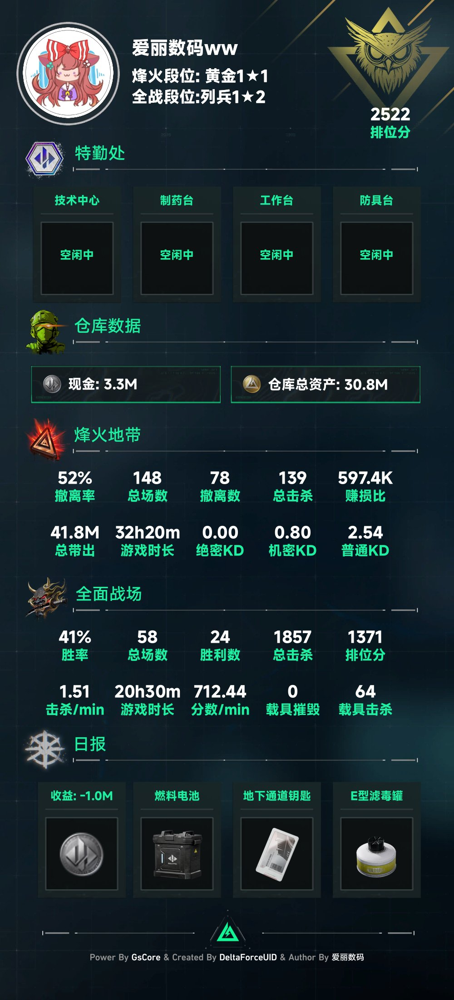
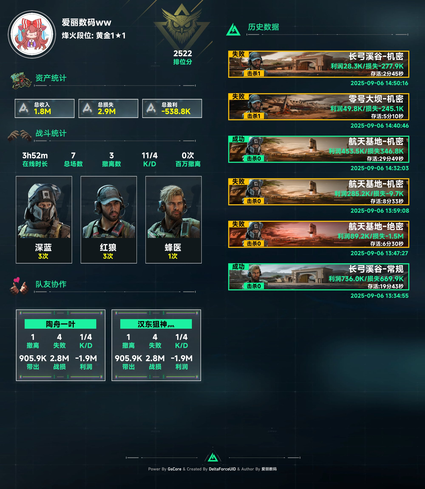

  

<h1 align = "center">三角洲UID DeltaUID 0.2.0</h1>
<h4 align = "center">🚧支持QQ群/频道、OneBot、微信、KOOK、Tg、飞书、Discord的三角洲查询插件🚧</h4>

        <a href="http://docs.gsuid.gbots.work/#/" target="_blank">安装文档</a>

## 丨安装提醒

> **注意：该插件为[早柚核心(gsuid_core)](https://github.com/Genshin-bots/gsuid_core)的扩展，具体安装方式可参考[GenshinUID](https://github.com/KimigaiiWuyi/GenshinUID)**
>
> 支持 NoneBot2 & HoshinoBot & ZeroBot & YunzaiBot & Koishi 的三角洲查询插件

## 功能展示

</img> </img>

## 丨安装方式

### | 方法一

1. 发送`core安装插件DeltaUID`
2. 发送`core重启`应用插件

### | 方法二

1. 进入 plugins 目录，`git clone --depth 1 https://github.com/Agnes4m/DeltaUID.git --depth=1 --single-branch`
2. 发送`core重启`应用插件

## 丨说明

- 查询三角洲的总体信息，日报，周报等等

## 丨功能

> 使用`鼠鼠帮助`或者`ss帮助`查看帮助指令

- `ss登录`
- `ss查询/日报`
- `ss战绩/周报`

### 丨跨bot UID绑定

> 由于登录二维码后之前的token失效，因此新增导出和添加功能
> 导出/添加的部分只涉及token信息部分，若绑定则需要手动发额外指令绑定

- `ss导出` 导出当前账号的信息
- `ss添加` 增加账号的信息(并不会直接绑定，需要再使用绑定指令绑定)
- `ss绑定` 绑定新的UID账号
- `ss添加ck` 从浏览器抓取cookie并添加到账号信息中

### 浏览器获取cookie

1. 准备via浏览器(或其他类似浏览器)，在浏览器中打开 [https://pvp.qq.com/cp/a20161115tyf/page1.shtml](https://pvp.qq.com/cp/a20161115tyf/page1.shtml)
2. 在网页中进行QQ登陆
3. 点击左上角的网页名左侧的盾图标
4. 点击查看cookies，然后复制全部内容
5. 返回QQ，私聊机器人，发送 `ss添加ck` 刚刚复制的cookies
6. 成功登陆

## 丨其他

- 插件基于[早柚核心(gsuid_core)](https://github.com/Genshin-bots/gsuid_core)开发
- 原代码来自[nonebot-plugin-delta-helper](https://github.com/BraveCowardp/nonebot-plugin-delta-helper)，在此基础上适配 core，并优化部分功能，为防止冲突本插件不适用`三角洲`关键词前缀，改用`ss`
